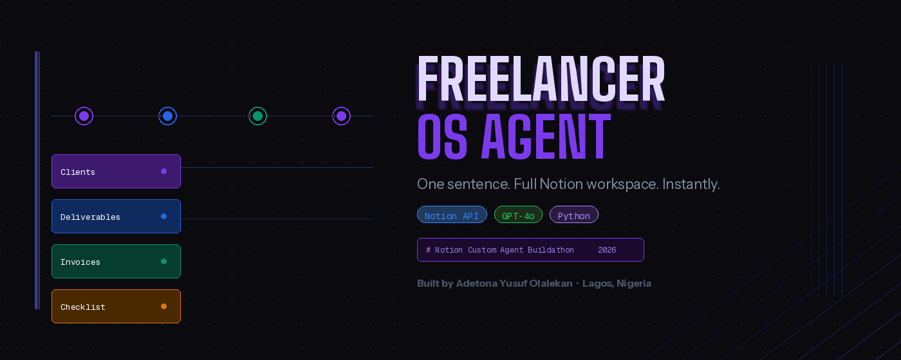

# Freelancer-OS-Agent

### A Notion Custom Agent that builds your entire client workspace from a single sentence

---

## The Story Behind This

My name is Adetona Yusuf Olalekan. I'm a freelancer based in Lagos, Nigeria.

A few months ago, I landed three clients in the same week. It should have been a great week. Instead, I spent most of it doing admin, copying client names into spreadsheets, creating project folders, writing kickoff emails, drafting invoice templates, and setting up task boards. By the time I actually started the work, I was already exhausted and behind.

The worst part? I did this for every single client. The same steps, in the same order, every time. There was no reason a human should be doing this.

So I built **Freelancer OS Agent** — a Notion Custom Agent that takes one plain-English sentence and builds your entire client workspace automatically. You type the brief. The agent handles everything else.

---

## What It Does

Type something like this:

> *"New client: Acme Corp. They need a full brand redesign including logo, website and social media kit. Budget is $4,500, deadline is June 30 2025, starting April 1."*

And within seconds, your Notion workspace is fully set up:

| What gets created | Details |
|---|---|
| **Client record** | Name, status, project type, budget, start date, deadline — all extracted and saved |
| **Deliverables board** | 5 tasks auto-generated and added to a Kanban board, linked to the client |
| **Invoice entry** | Draft invoice created with the correct amount and due date |
| **Kickoff checklist** | 5 onboarding action items categorised as Admin, Comms, Legal, and Setup |

Everything is linked together. Click a deliverable - it shows which client it belongs to. Click an invoice - same thing. Your entire operation is connected from day one.

---

## Demo

> *Run the agent → watch Notion build itself in real time*

```
=======================================================
  FREELANCER OS AGENT
=======================================================
Parsing brief with AI...
  Client:       Acme Corp
  Project type: Design
  Budget:       $4500
  Deadline:     2025-06-30

Creating client in Notion...
  Created: Acme Corp

Creating deliverables...
  + Create a new logo
  + Redesign the website
  + Develop a social media kit
  + Provide brand guidelines
  + Produce marketing materials

Creating invoice entry...
  Invoice INV-20260327-001 — $4500

Creating kickoff checklist...
  + Conduct a kick-off meeting
  + Gather existing brand materials
  + Define project milestones
  + Confirm client preferences and brand vision
  + Set up project management tools

=======================================================
  Workspace ready for: Acme Corp
  Check your Notion — all 4 databases updated!
=======================================================
```

---

## How It Works

```
User types a brief
        ↓
AI (GPT-4o-mini) extracts structured data
— client name, project type, budget, deadlines, tasks
        ↓
Notion API creates entries across 4 databases simultaneously
— Clients → Deliverables → Invoices → Kickoff Checklist
        ↓
Everything is linked. Workspace is ready.
```

The agent uses AI to understand natural language — not rigid form fields. You write the brief the way you'd explain it to a colleague. The agent figures out the rest.

---

## Tech Stack

- **Notion Custom Agent** — runs natively inside your Notion workspace
- **Notion API** — reads and writes to your databases in real time
- **OpenAI GPT-4o-mini** — parses natural language briefs into structured data
- **Python** — orchestrates the full agent pipeline

---

## Setup

### 1. Clone the repo
```bash
git clone https://github.com/your-username/freelancer-os-agent
cd freelancer-os-agent
```

### 2. Install dependencies
```bash
pip install notion-client openai python-dotenv
```

### 3. Set up your `.env`
```
NOTION_TOKEN=ntn_your_token_here
OPENAI_API_KEY=sk-proj-your_key_here
CLIENTS_DB_ID=your_clients_db_id
DELIVERABLES_DB_ID=your_deliverables_db_id
INVOICES_DB_ID=your_invoices_db_id
CHECKLIST_DB_ID=your_checklist_db_id
```

### 4. Set up your Notion workspace
Create 4 databases inside a parent page called `Freelancer OS`:

**Clients** — Client name (Title), Status (Select), Project type (Select), Budget (Number), Deadline (Date), Brief (Text), Start date (Date)

**Deliverables** — Task name (Title), Client (Relation), Stage (Select), Due date (Date), Priority (Select), Notes (Text)

**Invoices** — Invoice ID (Title), Client (Relation), Amount (Number), Status (Select), Issue date (Date), Due Date (Date)

**Kickoff checklist** — Task (Title), Client (Relation), Done (Checkbox), Category (Select)

### 5. Connect your integration
In each database: `...` → Connections → connect your Notion integration

### 6. Run the agent
```bash
python agent.py
```

---

## The Problem This Solves

Every freelancer spends hours on admin that should take minutes. The onboarding process — setting up a client workspace, creating tasks, drafting invoices, building checklists — is identical every time. It's repetitive, error-prone, and it takes time away from the actual work.

Freelancer OS Agent eliminates that entire process. One sentence. Fully set up. Ready to work.

---

## Who It's For

Any freelancer, consultant, or independent professional who manages clients in Notion and wants to eliminate manual onboarding forever. Designers, developers, writers, marketers, consultants - anyone who has ever copied a client name into a spreadsheet for the hundredth time.

---

## Built by

**Adetona Yusuf Olalekan**
Lagos, Nigeria
Built for the Notion Custom Agent Buildathon — March 2026

*"I built the tool I wish I had when I started freelancing."*

---

## What's Next

- Auto-generate a client contract from the brief
- Send a kickoff email draft directly from Notion
- Weekly progress summary auto-posted to the client page
- Multi-currency invoice support
- Weekly progress summary auto-posted to the client page
- Multi-currency invoice support
